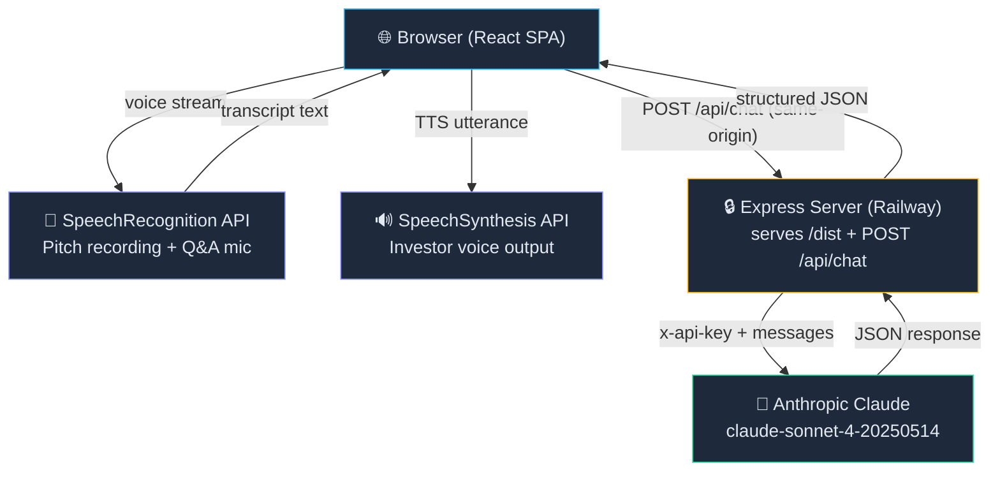
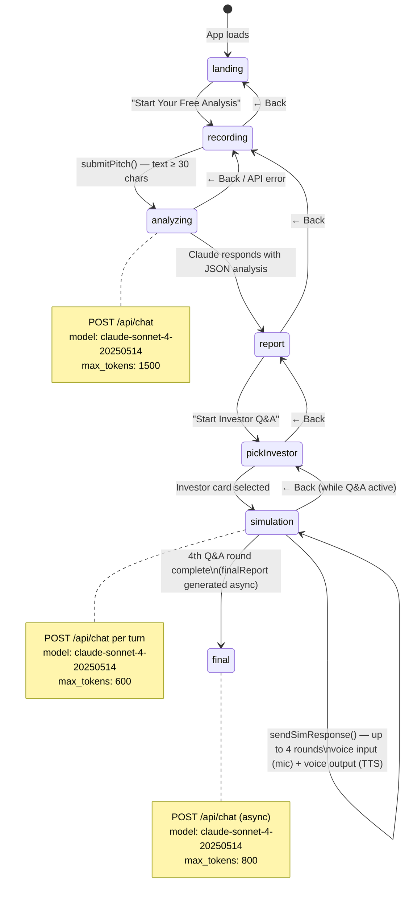
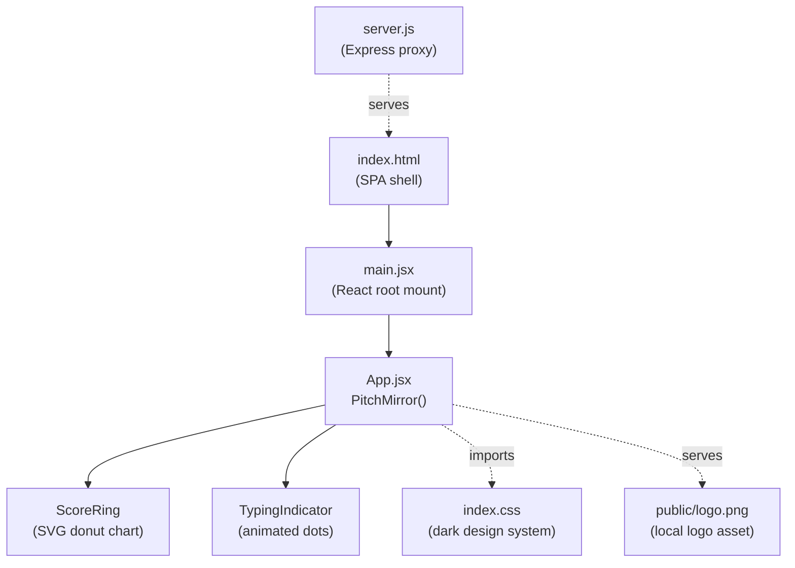
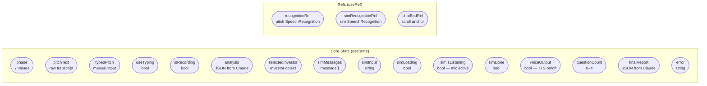
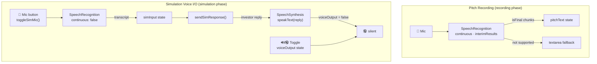
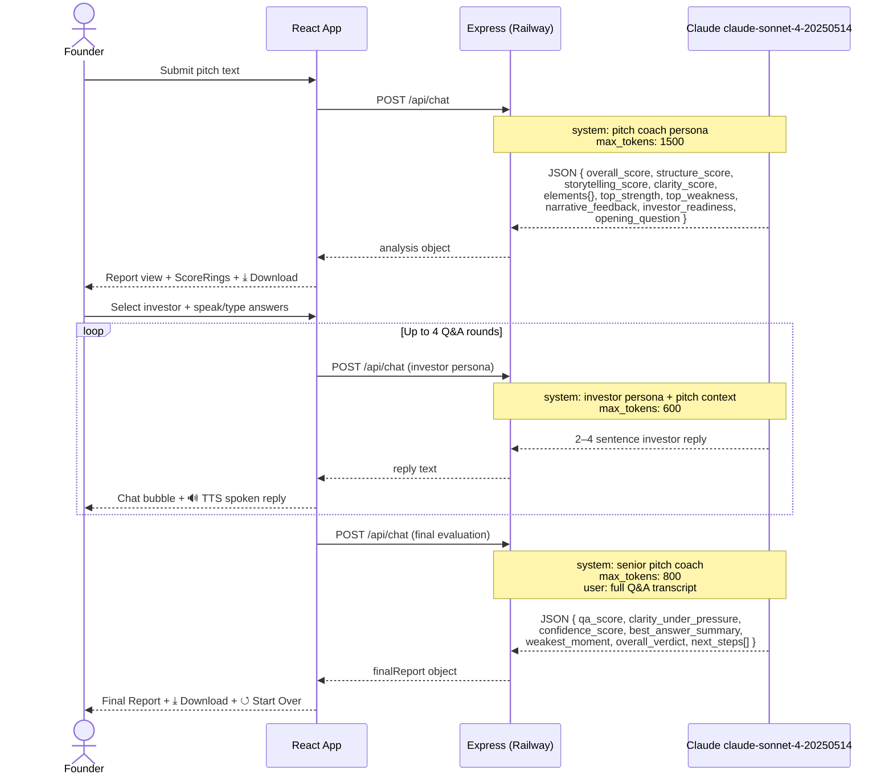
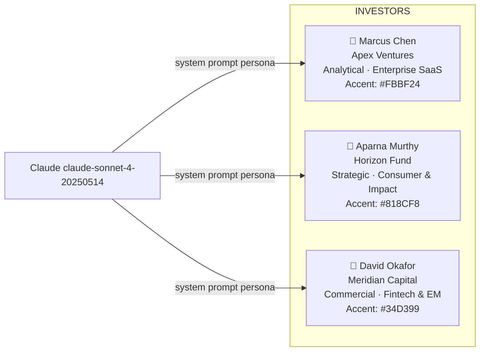
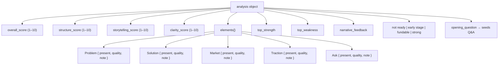
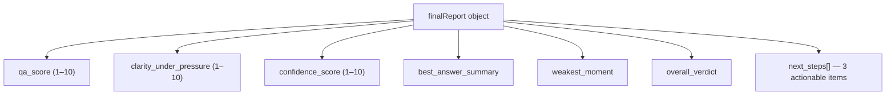
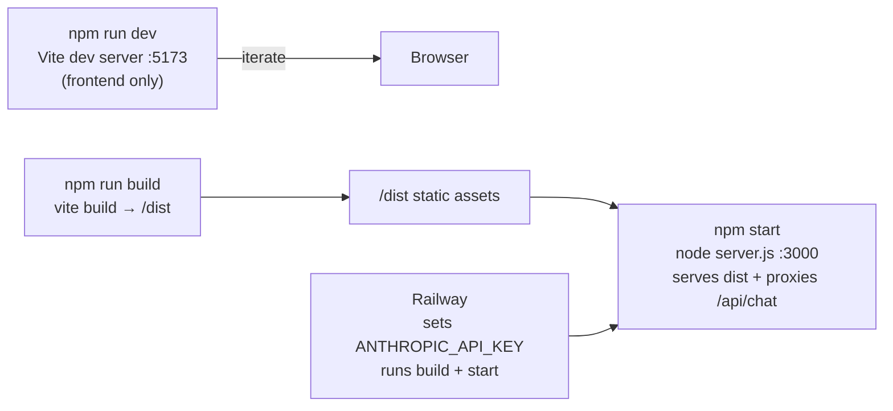

# PitchMirror — Architecture Document

> **Last updated:** March 2026  
> A living reference covering the full techno-functional architecture of PitchMirror.

---

## 1. Overview

**PitchMirror** is a full-stack web application (React SPA + Express proxy) that helps startup founders sharpen their investor pitches using AI. The frontend runs entirely in the browser; all Claude API calls are routed through a lightweight Express server that keeps the Anthropic API key server-side. No database, no user accounts.

---

## 2. Technology Stack

| Layer | Technology | Version | Role |
|---|---|---|---|
| Framework | React | 18.2 | Component-driven UI |
| Bundler | Vite | 5.2 | Dev server + production build |
| Language | JSX (ES Modules) | — | UI logic & templating |
| Styling | Vanilla CSS | — | Dark-mode design system |
| Fonts | Google Fonts (Inter, Roboto Slab) | — | Typography |
| Backend proxy | Express | 4.x | Serves SPA + proxies Anthropic API |
| AI Model | Anthropic Claude | `claude-sonnet-4-20250514` | All intelligence |
| Voice input | Web Speech API — SpeechRecognition | — | Pitch recording + sim mic |
| Voice output | Web Speech API — SpeechSynthesis | — | Investor TTS in simulation |
| Hosting | Railway | — | Runs `node server.js` |

---

## 3. High-Level Architecture

---

## 4. Application Phase State Machine

Orchestrated by a single `phase` state variable. Back buttons are available on every phase except landing. The final report overlays the simulation phase.

---

## 5. Component & File Structure

### File Inventory

| File | Purpose |
|---|---|
| `src/main.jsx` | React DOM root — renders `<PitchMirror />` into `#root` |
| `src/App.jsx` | Entire app: state machine, all views, AI calls, voice I/O, sub-components |
| `src/index.css` | Global dark-mode design tokens, layout classes, button variants |
| `index.html` | SPA shell — `
` |
| `server.js` | Express: serves `/dist`, proxies `POST /api/chat` to Anthropic |
| `public/logo.png` | App logo (local asset, generated) |
| `vite.config.js` | Vite config — `@vitejs/plugin-react` |
| `package.json` | Dependencies, scripts (`dev`, `build`, `start`) |
| `.env` | `ANTHROPIC_API_KEY` — read by server.js only, never in browser |

---

## 6. State Management

All state lives inside the single `PitchMirror` component via React `useState` and `useRef` — no external library.

---

## 7. Voice I/O Pipeline

---

## 8. AI Integration — Three Claude Calls

---

## 9. AI Persona Roster

Three investor personas are hardcoded as constant objects. Each drives a distinct simulation style.

---

## 10. Pitch Analysis Output Schema

---

## 11. Final Report Output Schema

---

## 12. Design System

| Token | Value | Usage |
|---|---|---|
| Background | `#0F172A` | Page root |
| Surface | `#1E293B` | Cards, chat bubbles, mic button |
| Border | `#334155` | All borders |
| Primary text | `#E2E8F0` | Body copy |
| Muted text | `#94A3B8` | Subtitles, labels |
| Accent blue | `#38BDF8` | Primary CTAs, user chat bubbles |
| Score green | `#4ADE80` | Scores ≥ 8 |
| Score amber | `#FBBF24` | Scores 5–7 |
| Score red | `#F87171` | Scores ≤ 4 |
| Download green | `#10B981` | Download buttons |
| Mic active red | `#EF4444` | Pulsing mic button border |
| Font (headings) | Roboto Slab 700 | Landing title |
| Font (body) | Inter 400/600/700 | All other text |
| Font (scores) | DM Mono (inline) | ScoreRing numbers |

---

## 13. Build & Deployment

### Scripts

| Script | Command | Purpose |
|---|---|---|
| `dev` | `vite` | Hot-reload frontend dev |
| `build` | `vite build` | Production SPA bundle → `/dist` |
| `preview` | `vite preview` | Preview built bundle locally |
| `start` | `node server.js` | Express server: serves dist + AI proxy |
| `lint` | `eslint . --ext js,jsx` | Static analysis |

---

## 14. Key Architectural Decisions & Trade-offs

| Decision | Rationale | Trade-off |
|---|---|---|
| **Express proxy (`server.js`)** | API key stays server-side; eliminates CORS | Must be kept live on Railway |
| **Single-file app (`App.jsx`)** | Rapid prototyping; zero routing complexity | Harder to split at scale |
| **No database** | Zero infra; stateless per session | Session lost on refresh |
| **Web Speech API** | Native browser; no third-party libs | Chrome/Edge best; Safari limited |
| **SpeechSynthesis for TTS** | Zero cost; native; no latency | Voice quality varies by OS/browser |
| **Hardcoded investor personas** | Curated, high-quality prompts | New investors need a code change |
| **Phase-based navigation** | Strict linear flow; clear UX | Cannot deep-link to a specific phase |
| **JSON-only Claude outputs** | Deterministic parsing; no post-processing | Requires careful prompt engineering |
