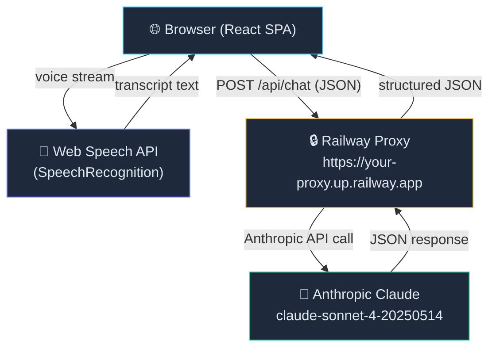
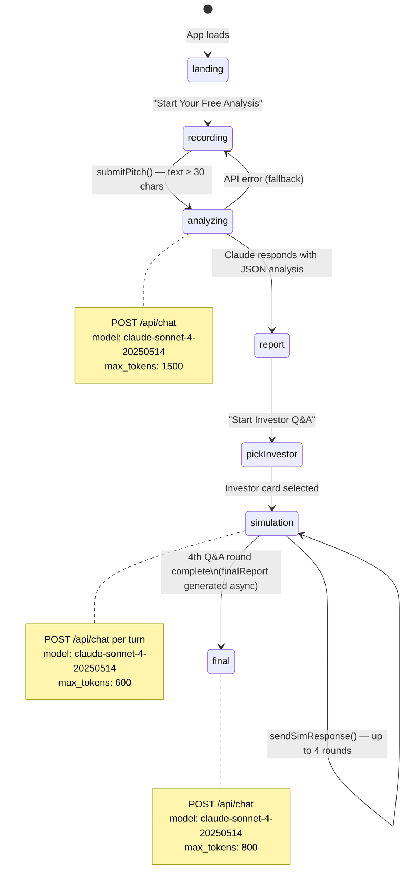
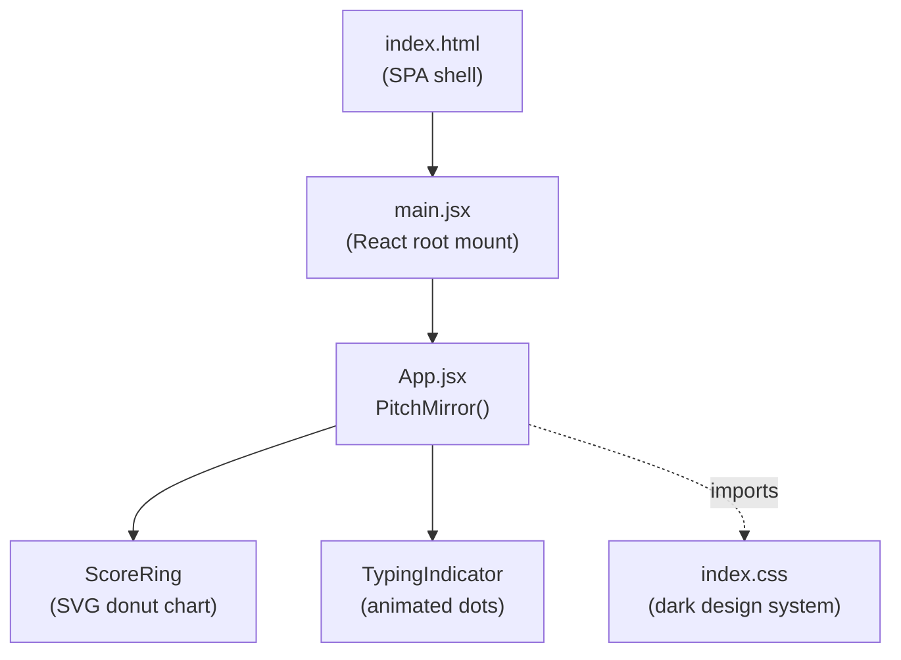
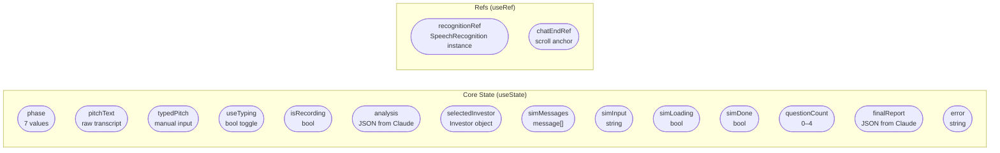
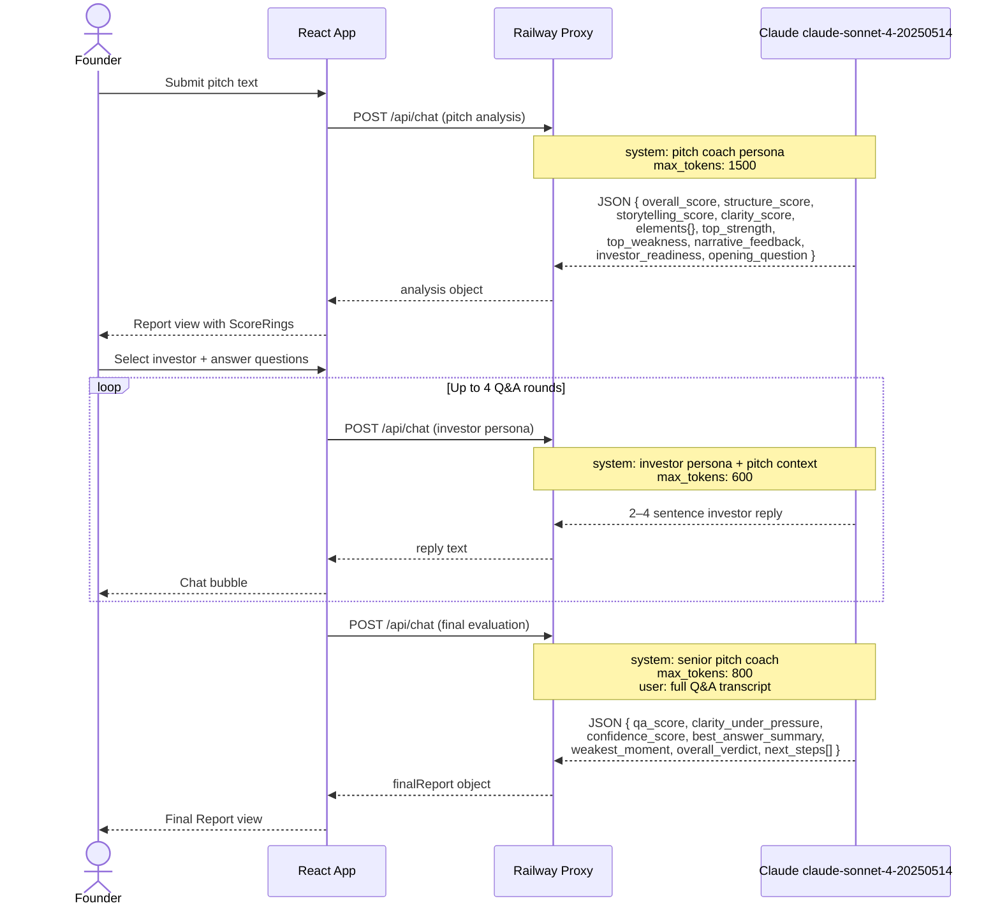
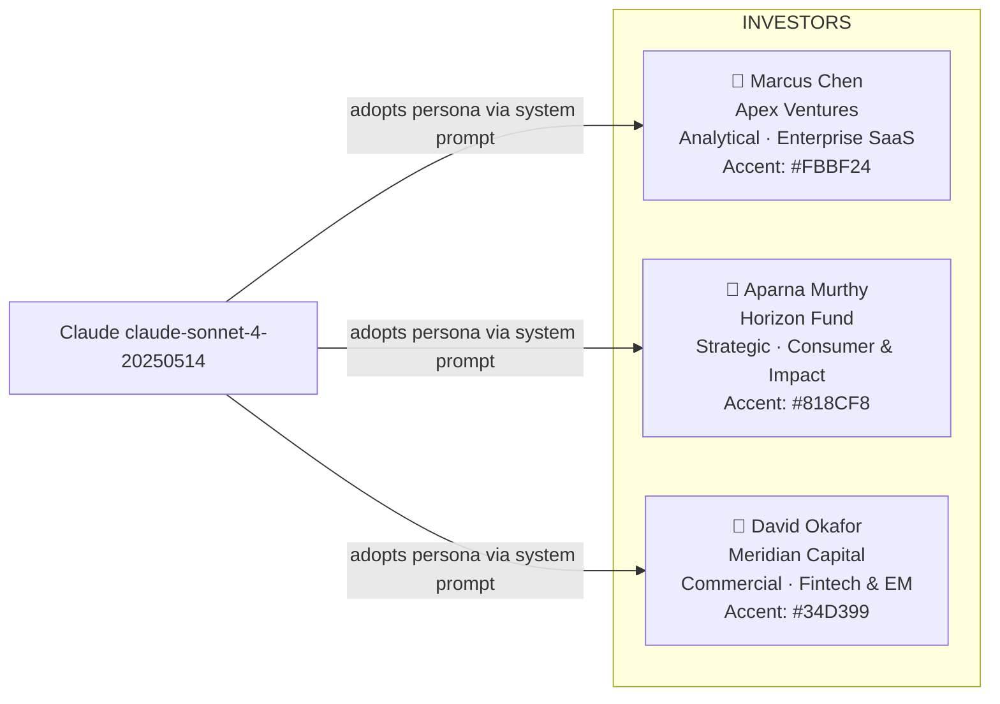
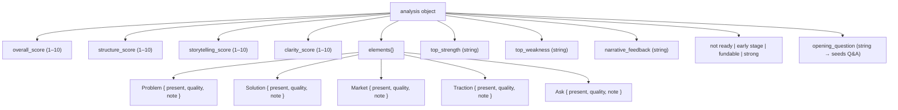
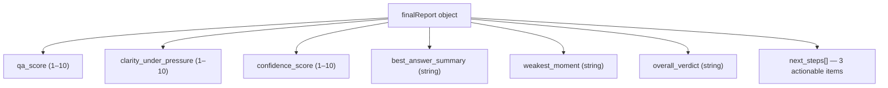
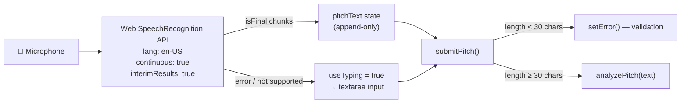
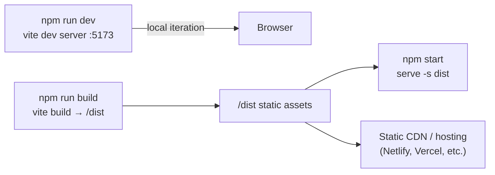

# PitchMirror — Architecture Document

> **Last updated:** March 2026  
> A living reference covering the full techno-functional architecture of PitchMirror.

---

## 1. Overview

**PitchMirror** is a single-page web application (SPA) that helps startup founders sharpen their investor pitches using AI. The entire experience runs in the browser — no backend database, no user accounts. All intelligence is delegated to **Anthropic Claude claude-sonnet-4-20250514** via a lightweight proxy server hosted on Railway.

---

## 2. Technology Stack

| Layer | Technology | Version | Role |
|---|---|---|---|
| Framework | React | 18.2 | Component-driven UI |
| Bundler | Vite | 5.2 | Dev server + production build |
| Language | JSX (ES Modules) | — | UI logic & templating |
| Styling | Vanilla CSS | — | Dark-mode design system |
| Fonts | Google Fonts (Inter, Roboto Slab) | — | Typography |
| AI Model | Anthropic Claude claude-sonnet-4-20250514 | — | All intelligence |
| AI Proxy | Custom REST proxy on Railway | — | Hides API credentials |
| Browser API | Web Speech API (SpeechRecognition) | — | Voice-to-text recording |
| Hosting | Vite preview / `serve` (static) | — | Production static serving |

---

## 3. High-Level Architecture

---

## 4. Application Phase State Machine

The app is orchestrated by a single `phase` state variable that drives which view is rendered. There is no router — phase transitions replace the view entirely.

---

## 5. Component & File Structure

### File Inventory

| File | Size | Purpose |
|---|---|---|
| `src/main.jsx` | 234 B | React DOM root — renders `<PitchMirror />` into `#root` |
| `src/App.jsx` | 23 KB | Entire app: state machine, all views, AI calls, sub-components |
| `src/index.css` | 2.9 KB | Global dark-mode design tokens and view layout classes |
| `index.html` | 360 B | SPA shell, sets `
` |
| `vite.config.js` | 162 B | Vite config — applies `@vitejs/plugin-react` |
| `package.json` | 729 B | Dependencies, scripts (`dev`, `build`, `preview`, `start`) |

---

## 6. State Management

All state lives inside the single `PitchMirror` component via React `useState` and `useRef` hooks — no external state library.

---

## 7. AI Integration Detail

PitchMirror makes **three distinct Claude API calls**, each with a purpose-built system prompt and JSON output schema.

---

## 8. AI Persona Roster

Three investor personas are hardcoded as constant objects. Each drives a distinct simulation style.

---

## 9. Pitch Analysis Output Schema

Claude is constrained to return strict JSON. The app parses this directly with `JSON.parse()`.

---

## 10. Final Report Output Schema

---

## 11. Voice Input Pipeline

---

## 12. Design System

| Token | Value | Usage |
|---|---|---|
| Background (dark) | `#0F172A` | Page root |
| Surface | `#1E293B` | Cards, panels, chat bubbles |
| Border | `#334155` | All borders |
| Primary text | `#E2E8F0` | Body copy |
| Muted text | `#94A3B8` | Subtitles, labels |
| Accent blue | `#38BDF8` | CTAs, user chat bubbles |
| Score green | `#4ADE80` | Scores ≥ 8 |
| Score amber | `#FBBF24` | Scores 5–7 |
| Score red | `#F87171` | Scores ≤ 4 |
| Font (headings) | Roboto Slab 700 | Landing title, section heads |
| Font (body) | Inter 400/600/700 | All other text |
| Font (scores) | DM Mono (inline) | ScoreRing label |

---

## 13. Build & Deployment

### Scripts

| Script | Command | Purpose |
|---|---|---|
| `dev` | `vite` | Hot-reload dev server |
| `build` | `vite build` | Optimised production bundle |
| `preview` | `vite preview` | Preview production build locally |
| `start` | `serve -s dist` | Serve built `/dist` as SPA |
| `lint` | `eslint . --ext js,jsx` | Static code analysis |

---

## 14. Key Architectural Decisions & Trade-offs

| Decision | Rationale | Trade-off |
|---|---|---|
| **Single-file app (`App.jsx`)** | Rapid prototyping; zero routing complexity | Harder to maintain at scale |
| **No backend / database** | Zero infra; fully static hosting | No persistence — session state lost on refresh |
| **Railway proxy for API key** | API key is never exposed to the browser | Extra network hop; proxy must be kept live |
| **Hardcoded investor personas** | Curated, high-quality prompts; no config needed | Adding new investors requires a code change |
| **Web Speech API** | Native browser API; no third-party libs | Varies by browser; graceful fallback to textarea |
| **Phase-based navigation** | Enforces strict linear flow | Cannot deep-link to a specific phase |
| **JSON-only Claude outputs** | Deterministic parsing; no markdown stripping needed | Prompt engineering effort required |
